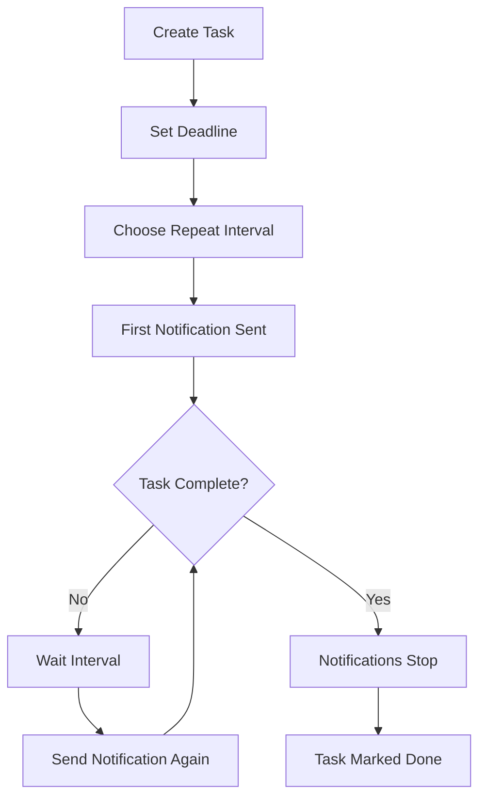

<div align="center">


# 🔥 Doping

**The Productivity App That Won't Let You Procrastinate**

[](https://flutter.dev)
[](https://dart.dev)
[](LICENSE)

### ⚡ Aggressive Task Management + ⏱️ Pomodoro Timer = 💪 Unstoppable Productivity

*Stop procrastinating. Start doing.*

</div>

---

## 💥 What Makes Doping Different?

Most todo apps are **soft**. They send you one gentle reminder and give up when you ignore it.

**Not Doping.**

Doping is the productivity app with **teeth**. It uses **relentless recurring notifications** to keep your tasks front and center until you actually complete them. Combined with an integrated **Pomodoro Timer**, Doping creates a productivity system that's impossible to ignore.

### 🎯 Core Philosophy

1. **📢 Relentless Reminders**: Set recurring notifications from every minute to every week - your tasks will haunt you until completed
2. **⏱️ Focused Work Sessions**: Built-in Pomodoro timer keeps you in the zone with structured work/break cycles
3. **⚡ Zero Escape Routes**: Quick actions let you complete tasks from notifications, but you can't dismiss them without action
4. **📊 Accountability**: Live statistics track your progress - no hiding from incomplete tasks

---

## 📱 Screenshots

<div align="center">

| Persistent Todo List | Quick Task Creation | Integrated Pomodoro |
|:--------------------:|:-------------------:|:-------------------:|
|  |  |  |

| Language Settings | 1x1 Widgets | Relentless Notifications |
|:-----------------:|:-----------:|:------------------------:|
|  |  |  |

</div>

---

## 🔥 Killer Features

### 1. 📢 **Relentless Recurring Notifications** - The Heart of Doping

**The Problem**: Traditional todo apps send one notification that you swipe away and forget.

**The Doping Solution**: 
- ⏰ **Continuous Reminders**: Choose intervals from **1 minute to 1 week** - your task will keep notifying you
- 🔁 **Never Stops Until Done**: Notifications repeat at your chosen interval until you mark the task complete
- 🚫 **No Easy Escape**: Can't just dismiss - you have to take action
- ⚡ **Quick Complete Action**: Tap "✓ Complete" directly from notification to mark done instantly
- 🎯 **Deadline Pressure**: Visual countdown shows time remaining (hours, minutes) or OVERDUE status

**Perfect For:**
- Important recurring tasks that MUST get done
- Breaking procrastination cycles
- Building consistent habits
- Accountability partners who won't give up

**Available Intervals:**
```
Every 1 minute  → For urgent tasks requiring immediate attention
Every 5 minutes → For high-priority items you're actively avoiding
Every 10 minutes → Persistent reminders during work sessions  
Every 30 minutes → Regular check-ins throughout the day
Every 1 hour → Hourly accountability nudges
Every 1 day → Daily recurring responsibilities  
Every 1 week → Weekly review reminders
```

### 2. 🍅 **Integrated Pomodoro Timer** - Structured Productivity

**Why Pomodoro + Recurring Notifications = Productivity Perfection**

The Pomodoro Technique structures your work into focused sessions. Doping's recurring notifications ensure you actually START those sessions.

**Features:**
- ⏱️ **Customizable Sessions**: Set your own Work, Break, and Rest durations
- 🔄 **Automatic Cycling**: 
  ```
  Work (25 min) → Break (5 min) → Work → Break → Work → Rest (15 min)
  ```
  After 3 work sessions, you get a longer rest period
  
- 🎨 **Visual Progress**: 
  - **Work Phase** (Red): Focus time - get stuff done
  - **Break Phase** (Teal): Short break - recharge
  - **Rest Phase** (Green): Long break - recover fully
  
- 📊 **Session Tracking**: See how many pomodoros you've completed
- 🔔 **Phase Notifications**: Alerts when it's time to work or break
- 📱 **Quick Start Widget**: Launch Pomodoro from home screen (1x1 widget)
- 💾 **Settings Persistence**: Your preferences are saved

**The Workflow:**
1. Check your todo list with upcoming notifications
2. Start Pomodoro timer for focused work
3. Work until notification reminds you
4. Complete task and stop the recurring notifications
5. Take your earned break

### 3. ⚡ **Zero-Friction Task Management**

- **1x1 Quick Add Widget**: Add tasks in seconds from home screen
- **Swipe to Delete**: Clean up completed tasks effortlessly
- **One-Tap Complete**: Check tasks done from notifications or list
- **Smart Scheduling**: DatePicker + TimePicker for precise deadlines
- **Rich Task Details**: Title, description, deadline, repeat interval

### 4. 📊 **Live Progress Dashboard**

Your stats update in real-time:
- **Total Tasks**: Everything on your plate
- **Incomplete**: What's still haunting you
- **Completed**: Your victories

### 5. 🌍 **Bilingual Support**

- 🇬🇧 **English** 
- 🇻🇳 **Tiếng Việt**
- ⚙️ Switch languages instantly from Settings

---

## 🎯 Perfect For

✅ **Chronic Procrastinators**: The app won't let you forget  
✅ **ADHD Warriors**: Constant reminders keep tasks visible  
✅ **Accountability Seekers**: Like having a persistent productivity coach  
✅ **Pomodoro Practitioners**: Built-in timer means one less app  
✅ **Habit Builders**: Recurring reminders build consistency  
✅ **Students & Professionals**: Deadline-driven work with focus sessions

---

## 🚀 Quick Start

### Installation

```bash
# Clone repository
git clone https://github.com/yourusername/doping.git
cd doping

# Install dependencies
flutter pub get

# Run on your device
flutter run
```

### First-Time Setup

1. **Grant Notification Permissions**: Doping NEEDS this to keep you accountable
2. **Create Your First Task**:
   - Tap the yellow `+` button
   - Set a deadline
   - Choose notification interval (start with 30 minutes if unsure)
   - Hit Save
3. **Prepare to Be Reminded**: Your task will start notifying you at your chosen interval
4. **Complete It**: Tap ✓ in the notification or tap the checkbox to stop the reminders

### Using Pomodoro

1. Switch to **Pomodoro** tab
2. Tap **Settings** to customize durations
3. Hit **Start** when ready to focus
4. Work until the notification says "Work phase complete!"
5. Take your break
6. Repeat

---

## 📖 How It Works

### The Relentless Reminder System



**Key Points:**
- Notifications start at task creation
- They repeat **forever** at your chosen interval
- They **only stop** when you mark task complete
- Quick action in notification = fastest way to silence them
- Miss your deadline? Notifications turn red and say "OVERDUE"

### The Pomodoro Cycle

```
Session 1: Work (25m) → Break (5m)
Session 2: Work (25m) → Break (5m)  
Session 3: Work (25m) → Rest (15m) ← Longer break after 3 sessions
→ Cycle repeats
```

Each phase completion triggers a notification. Can't ignore when it's time to work or break.

---

## 🛠️ Tech Stack

**Frontend**: Flutter 3.10.4 (Dart 3.0+)  
**State Management**: Provider  
**Database**: SQLite (sqflite)  
**Notifications**: flutter_local_notifications + timezone  
**Widgets**: home_widget (Android)  
**Localization**: flutter_localizations + intl  

**Key Libraries:**
```yaml
dependencies:
  sqflite: ^2.3.0                          # Local database
  flutter_local_notifications: ^17.0.0     # Persistent notifications
  timezone: ^0.9.2                         # Scheduled notifications
  shared_preferences: ^2.2.2               # Settings storage
  home_widget: ^0.6.0                      # Home screen widgets
  provider: ^6.1.0                         # State management
```

---

## 🎨 Design System

### Color Psychology

| Color | Hex | Usage | Psychology |
|-------|-----|-------|------------|
| **Primary Yellow** | `#FFD700` | Actions, CTAs | Energy, urgency, attention-grabbing |
| **Work Red** | `#FF6B6B` | Pomodoro work phase | Intense focus, alertness |
| **Break Teal** | `#4ECDC4` | Short breaks | Calm, refreshing |
| **Rest Green** | `#95E1D3` | Long breaks | Recovery, peace |
| **Overdue Red** | `#FF0000` | Missed deadlines | Warning, critical |

---

## 📱 Widgets & Notifications

### Android Widgets (1x1)

**Todo Widget**: Yellow `+` button → Opens add task screen  
**Pomodoro Widget**: Red `▶` button → Starts timer immediately

Add widgets:
1. Long-press home screen
2. Tap "Widgets"
3. Find "Doping"
4. Drag to home screen

### Notification Actions

Every task notification includes:
- **✓ Complete**: Mark done instantly without opening app
- **Tap notification**: Open task details to edit

**Permissions Required (Android):**
- `POST_NOTIFICATIONS` - Send reminders
- `SCHEDULE_EXACT_ALARM` - Precise timing
- `USE_EXACT_ALARM` - Background scheduling
- `RECEIVE_BOOT_COMPLETED` - Survive device restart

---

## 🔧 Configuration

### Customize Notification Frequency

Edit intervals in `AddEditTodoScreen`:
```dart
final List<Map<String, dynamic>> _getRepeatIntervals(BuildContext context) {
  return [
    {'label': '1 minute', 'minutes': 1},    // Most aggressive
    {'label': '5 minutes', 'minutes': 5},
    {'label': '10 minutes', 'minutes': 10},
    // ... add your own intervals
  ];
}
```

### Customize Pomodoro Defaults

In `PomodoroService`:
```dart
_settings = PomodoroSettings(
  workMinutes: 25,    // Change default work time
  breakMinutes: 5,    // Change default break time
  restMinutes: 15,    // Change default rest time
);
```

---

## 📂 Project Structure

```
doping/
├── lib/
│   ├── l10n/                      # Translations (EN, VI)
│   ├── models/
│   │   ├── todo_model.dart        # Task data structure
│   │   └── pomodoro_*.dart        # Timer models
│   ├── services/
│   │   ├── database_helper.dart   # SQLite operations
│   │   ├── notification_service.dart  # Relentless reminders 🔥
│   │   └── pomodoro_service.dart  # Timer logic
│   ├── screens/
│   │   ├── todo_list_screen.dart  # Task dashboard
│   │   ├── add_edit_todo_screen.dart
│   │   ├── pomodoro_screen.dart   # Timer interface
│   │   └── settings_screen.dart
│   └── main.dart
├── android/
│   └── app/src/main/kotlin/
│       ├── TodoWidgetProvider.kt      # Quick add widget
│       └── PomodoroWidgetProvider.kt  # Quick start widget
└── assets/icon/
    └── app_icon.svg               # Clock + Check + Tomato logo
```

---

## 🎯 Use Cases

### 1. Breaking Procrastination
**Problem**: You keep putting off that important task.

**Doping Solution**:
- Create task with 10-minute repeat interval
- Set deadline for today
- Get reminded every 10 minutes until done
- Can't ignore it - notifications won't stop

### 2. Building Habits
**Problem**: Want to drink water every hour, but forget.

**Doping Solution**:
- Create "Drink Water" task
- Set 1-hour repeat interval
- No deadline (ongoing)
- Persistent hourly reminders

### 3. Exam Study Sessions
**Problem**: Need focused study time with breaks.

**Doping Solution**:
- Create study tasks with 30-min reminders
- Use Pomodoro: 25min study → 5min break
- Notifications keep you honest
- Stats track completed sessions

### 4. Project Deadlines
**Problem**: Big project, easy to forget milestones.

**Doping Solution**:
- Break into tasks with deadlines
- Set aggressive reminders (5-15 min)
- As deadline approaches, notifications get more urgent
- Dashboard shows incomplete count (guilt factor)

---

## 🚧 Known Limitations

- ⚠️ Widget updates require app to be running (Android platform limit)
- ⚠️ macOS notifications need additional entitlements
- ⚠️ Can't snooze notifications (by design - complete the task!)

---

## 🗺️ Roadmap

### v1.1 - Cloud Sync
- [ ] Firebase backend
- [ ] Cross-device synchronization
- [ ] Notification sync across devices
- [ ] Dark mode

### v1.2 - Enhanced Accountability  
- [ ] Task priority levels (with even MORE aggressive reminders for high priority)
- [ ] Weekly progress reports
- [ ] Streak tracking
- [ ] Social accountability (share progress)

### v1.3 - Advanced Features
- [ ] Custom notification sounds (air horn mode?)
- [ ] Location-based reminders
- [ ] Integration with calendar
- [ ] Team/shared tasks

---

## 🤝 Contributing

Doping is open source! See [CONTRIBUTING.md](CONTRIBUTING.md) for guidelines.

**Areas we'd love help with:**
- More aggressive notification strategies
- Additional Pomodoro presets
- UI/UX improvements for productivity
- More languages
- iOS widgets support

---

## ⚖️ License

MIT License - See [LICENSE](LICENSE) for details.

Free to use, modify, and distribute. Use it to build better productivity habits!

---

## 🙏 Acknowledgments

Built with:
- [Flutter](https://flutter.dev) - Beautiful cross-platform UI
- [sqflite](https://pub.dev/packages/sqflite) - Reliable local storage
- [flutter_local_notifications](https://pub.dev/packages/flutter_local_notifications) - The relentless notification engine

Inspired by people who need that extra push to get things done. 💪

---

<div align="center">

### 🔥 Stop Procrastinating. Start Doping. 🔥

**Download • Remind • Complete • Repeat**

---

Made with 💪 and ☕ for productivity warriors everywhere

*"The app that won't let you give up on yourself."*

</div>


<div align="center">

| Todo List | Add Task | Pomodoro Timer |
|:---------:|:--------:|:--------------:|
|  |  |  |

| Settings | Widgets | Notification |
|:--------:|:-------:|:------------:|
|  |  |  |

</div>

---

## ✨ Tính Năng Nổi Bật

### 📝 Quản Lý Todo Thông Minh
- ✅ **CRUD Operations**: Tạo, đọc, cập nhật, xóa công việc với SQLite
- ⏰ **Deadline Management**: Đặt thời gian đến hạn với DatePicker + TimePicker
- 🔔 **Smart Notifications**: Thông báo lặp lại linh hoạt (1 phút → 1 tuần)
- ⚡ **Quick Actions**: Hoàn thành task ngay từ notification
- 📊 **Live Statistics**: Theo dõi tiến độ với cards thống kê real-time
- 🎨 **Swipe Actions**: Vuốt để xóa task nhanh chóng
- 📱 **1x1 Widget**: Thêm task mới chỉ với 1 tap từ home screen

### 🍅 Pomodoro Timer
- ⏱️ **Customizable Timer**: Tùy chỉnh thời gian Work/Break/Rest
- 🔄 **Auto Cycle**: Chu trình tự động Work → Break → Rest
- 📊 **Session Tracking**: Theo dõi số session đã hoàn thành
- 🔔 **Phase Notifications**: Thông báo khi chuyển phase
- 🎨 **Visual Progress**: Circular progress với màu sắc riêng cho mỗi phase
- 📱 **1x1 Widget**: Khởi động Pomodoro ngay từ home screen

### 🌍 Đa Ngôn Ngữ
- 🇬🇧 **English**: Giao diện tiếng Anh
- 🇻🇳 **Tiếng Việt**: Giao diện tiếng Việt
- ⚙️ **Runtime Switching**: Chuyển đổi ngôn ngữ không cần restart app

### 🎨 Giao Diện Đẹp Mắt
- 🌟 **Material Design 3**: Thiết kế hiện đại, mượt mà
- 🎨 **Color Theme**: Vàng (#FFD700) chủ đạo, gradient cho Pomodoro
- 📐 **Rounded Corners**: Bo góc mềm mại trên tất cả components
- 💫 **Smooth Animations**: Transitions và effects tự nhiên
- 🧭 **Bottom Navigation**: Di chuyển dễ dàng giữa các tab

---

## 🛠️ Tech Stack

### Frontend
- **Flutter 3.10.4** - Cross-platform UI framework
- **Material Design 3** - Modern design system
- **Provider** - State management

### Backend & Storage
- **SQLite** (`sqflite ^2.3.0`) - Local database
- **SharedPreferences** - Settings storage

### Notifications
- **flutter_local_notifications ^17.0.0** - Local push notifications
- **timezone ^0.9.2** - Timezone support for scheduling

### Widgets & Platform
- **home_widget ^0.6.0** - Android home screen widgets
- **MethodChannel** - Native platform communication

### Localization
- **flutter_localizations** - Multi-language support
- **intl** - Internationalization

---

## 📦 Cài Đặt & Chạy

### Yêu Cầu
- Flutter SDK ≥ 3.10.4
- Dart SDK ≥ 3.0.0
- Android Studio / Xcode (tùy platform)

### Cài Đặt Dependencies

```bash
# Clone repository
git clone https://github.com/yourusername/doping.git
cd doping

# Install dependencies
flutter pub get

# Run on Android
flutter run

# Run on iOS
flutter run -d ios

# Run on macOS (development)
flutter run -d macos
```

### Build Release

```bash
# Android APK
flutter build apk --release

# Android App Bundle
flutter build appbundle --release

# iOS
flutter build ios --release

# macOS
flutter build macos --release
```

---

## 📖 Hướng Dẫn Sử Dụng

### 📝 Todo Management

1. **Thêm Task Mới**
   - Tap nút `+` ở màn hình Todo
   - Hoặc tap widget 1x1 trên home screen
   - Nhập tiêu đề, mô tả (optional)
   - Chọn deadline (date + time)
   - Chọn tần suất nhắc nhở (1 phút - 1 tuần)
   - Tap `Lưu`

2. **Hoàn Thành Task**
   - Tap vào checkbox bên trái task
   - Hoặc tap nút "✓ Hoàn thành" trong notification
   - Task sẽ hiển thị gạch ngang và tắt thông báo

3. **Sửa Task**
   - Tap vào task để mở form chỉnh sửa
   - Cập nhật thông tin
   - Tap `Lưu`

4. **Xóa Task**
   - Vuốt task sang trái
   - Background đỏ sẽ hiện ra
   - Thả tay để xóa

5. **Lọc Task**
   - Tap icon ở góc phải appbar
   - Chuyển đổi giữa "Tất cả" và "Đã hoàn thành"

### 🍅 Pomodoro Timer

1. **Bắt Đầu Timer**
   - Chuyển sang tab Pomodoro
   - Hoặc tap widget Pomodoro trên home screen
   - Tap nút `Bắt đầu` (▶)
   - Timer sẽ bắt đầu đếm ngược

2. **Tạm Dừng / Tiếp Tục**
   - Tap nút `Tạm dừng` (⏸) để dừng
   - Tap nút `Bắt đầu` (▶) để tiếp tục

3. **Reset Timer**
   - Tap nút `Reset` (🔄) để reset về 0
   - Timer sẽ quay về phase Work và session 1

4. **Bỏ Qua Phase**
   - Tap nút `Skip` (⏭) để chuyển phase ngay lập tức
   - Hữu ích khi muốn nghỉ sớm hoặc làm việc tiếp

5. **Cài Đặt Timer**
   - Tap icon `Settings` (⚙️) ở góc phải
   - Nhập thời gian Work (phút)
   - Nhập thời gian Break (phút)
   - Nhập thời gian Rest (phút)
   - Tap `Lưu`

**Chu trình Pomodoro:**
```
Work → Break → Work → Break → Work → Rest → (lặp lại)
       (sau 1 session)     (sau 3 sessions)
```

### ⚙️ Settings

1. **Đổi Ngôn Ngữ**
   - Chuyển sang tab Settings
   - Tap vào `Language / Ngôn ngữ`
   - Chọn `English` hoặc `Tiếng Việt`
   - App sẽ cập nhật ngay lập tức

2. **Xem Thông Tin App**
   - Version: 1.0.0
   - Mô tả: Todo App với Pomodoro Timer

---

## 📁 Cấu Trúc Project

```
doping/
├── android/                    # Android native code
│   ├── app/src/main/
│   │   ├── kotlin/.../
│   │   │   ├── MainActivity.kt
│   │   │   ├── TodoWidgetProvider.kt
│   │   │   └── PomodoroWidgetProvider.kt
│   │   └── res/
│   │       └── layout/
│   │           ├── todo_widget.xml
│   │           └── pomodoro_widget.xml
├── ios/                        # iOS native code
├── lib/
│   ├── l10n/                   # Localization files
│   │   ├── app_en.arb         # English strings
│   │   ├── app_vi.arb         # Vietnamese strings
│   │   └── app_localizations.dart
│   ├── models/                 # Data models
│   │   ├── todo_model.dart
│   │   ├── pomodoro_settings.dart
│   │   └── pomodoro_state.dart
│   ├── providers/              # State management
│   │   └── locale_provider.dart
│   ├── screens/                # UI Screens
│   │   ├── home_screen.dart
│   │   ├── todo_list_screen.dart
│   │   ├── add_edit_todo_screen.dart
│   │   ├── pomodoro_screen.dart
│   │   └── settings_screen.dart
│   ├── services/               # Business logic
│   │   ├── database_helper.dart
│   │   ├── notification_service.dart
│   │   └── pomodoro_service.dart
│   └── main.dart              # Entry point
├── assets/
│   └── icon/
│       ├── app_icon.svg       # App icon (vector)
│       └── app_icon.png       # App icon (raster)
├── screenshots/                # App screenshots
├── pubspec.yaml               # Dependencies
├── l10n.yaml                  # Localization config
└── README.md                  # This file
```

---

## 🎨 Design System

### Color Palette

| Color | Hex | Usage |
|-------|-----|-------|
| **Primary Yellow** | `#FFD700` | Main accent, buttons, highlights |
| **Secondary Orange** | `#FFA500` | Secondary accents |
| **Background** | `#FFFBF0` | Screen background |
| **Surface** | `#FFFFFF` | Cards, elevated surfaces |
| **Work Red** | `#FF6B6B` | Pomodoro work phase |
| **Break Teal** | `#4ECDC4` | Pomodoro break phase |
| **Rest Green** | `#95E1D3` | Pomodoro rest phase |

### Typography
- **Headings**: Bold, 18-22px
- **Body**: Regular, 14-16px
- **Caption**: Regular, 12px

### Spacing
- **Small**: 8px
- **Medium**: 16px
- **Large**: 24px

### Border Radius
- **Small**: 10px
- **Medium**: 15-16px
- **Large**: 20px
- **Circle**: 25px+

---

## 🔔 Notifications

### Android

**Channels:**
- `todo_reminders` - Todo task reminders
- `pomodoro_timer` - Pomodoro phase notifications

**Actions:**
- `mark_complete` - Quick action to complete task from notification

**Permissions Required:**
- `POST_NOTIFICATIONS`
- `SCHEDULE_EXACT_ALARM`
- `USE_EXACT_ALARM`
- `RECEIVE_BOOT_COMPLETED`

### iOS

**Permissions:**
- Alert
- Badge
- Sound

---

## 📱 Widgets

### Todo Widget (1x1)
- **Icon**: Add (+) button on yellow background
- **Action**: Opens add task screen
- **Design**: Round corners, shadow

### Pomodoro Widget (1x1)
- **Icon**: Play (▶) button on red background
- **Action**: Starts Pomodoro timer
- **Design**: Round corners, shadow

**Adding Widgets:**
1. Long press on home screen
2. Tap "Widgets"
3. Search "Doping"
4. Drag widget to home screen

---

## 🌍 Localization

App hỗ trợ 2 ngôn ngữ:
- 🇬🇧 English (en)
- 🇻🇳 Tiếng Việt (vi)

**Thêm ngôn ngữ mới:**
1. Tạo file `lib/l10n/app_{locale}.arb`
2. Copy keys từ `app_en.arb`
3. Dịch tất cả values
4. Thêm `Locale('{locale}')` vào `supportedLocales` trong `main.dart`
5. Run `flutter pub get`

---

## 🧪 Testing

```bash
# Run all tests
flutter test

# Run with coverage
flutter test --coverage

# Run specific test file
flutter test test/widget_test.dart
```

---

## 🐛 Known Issues

- [ ] macOS notifications cần thêm entitlements
- [ ] Widget không auto-update khi app closed (Android limitation)

---

## 🗺️ Roadmap

- [ ] **v1.1**
  - [ ] Cloud sync với Firebase
  - [ ] Dark mode
  - [ ] More widget sizes (2x2, 4x2)
  
- [ ] **v1.2**
  - [ ] Task categories/tags
  - [ ] Recurring tasks (daily, weekly)
  - [ ] Task priority levels
  
- [ ] **v1.3**
  - [ ] Charts & analytics
  - [ ] Export/import data
  - [ ] Custom notification sounds

---

## 🤝 Contributing

Contributions are welcome! Please feel free to submit a Pull Request.

1. Fork the project
2. Create your feature branch (`git checkout -b feature/AmazingFeature`)
3. Commit your changes (`git commit -m 'Add some AmazingFeature'`)
4. Push to the branch (`git push origin feature/AmazingFeature`)
5. Open a Pull Request

---

## 📄 License

This project is licensed under the MIT License - see the [LICENSE](LICENSE) file for details.

---

## 👨‍💻 Author

**Your Name**
- GitHub: [@yourusername](https://github.com/yourusername)
- Email: your.email@example.com

---

## 🙏 Acknowledgments

- [Flutter](https://flutter.dev) - UI framework
- [Material Design](https://material.io) - Design system
- [sqflite](https://pub.dev/packages/sqflite) - SQLite database
- [flutter_local_notifications](https://pub.dev/packages/flutter_local_notifications) - Notifications
- Icons from [Material Icons](https://fonts.google.com/icons)

---

<div align="center">

**⭐ Nếu bạn thấy project này hữu ích, hãy cho một star nhé! ⭐**

Made with ❤️ and ☕ using Flutter

</div>


### Todo List

#### Thêm Công Việc Mới

1. Nhấn nút "+" ở góc dưới bên phải
2. Nhập tên công việc (bắt buộc)
3. Nhập mô tả (tùy chọn)
4. Chọn thời gian đến hạn
5. Chọn tần suất nhắc nhở
6. Nhấn "Tạo công việc"

#### Sử Dụng Android Widget
**Todo Widget (Vàng - Add Task):**
1. Long press trên màn hình chính Android
2. Chọn "Widgets"
3. Tìm "Todo App" widget (button vàng)
4. Kéo widget 1x1 vào màn hình chính
5. Nhấn button để mở app và thêm task nhanh

**Pomodoro Widget (Đỏ - Start Timer):**
1. Long press trên màn hình chính Android
2. Chọn "Widgets"
3. Tìm "Pomodoro Timer" widget (button đỏ)
4. Kéo widget 1x1 vào màn hình chính
5. Nhấn button để mở app và bắt đầu Pomodoro timer ngay lập tức

#### Hoàn Thành Task Nhanh Từ Notification

- Khi nhận notification về task chưa hoàn thành
- Nhấn button "✓ Hoàn thành" ngay trong notification
- Task sẽ được đánh dấu hoàn thành và notification bị hủy
- Không cần mở app!
5. Nhấn button "Thêm công việc mới" để mở app và thêm task nhanh

#### Đánh Dấu Hoàn Thành

- Nhấn vào icon tròn bên trái mỗi công việc để đánh dấu hoàn thành
- Khi đánh dấu hoàn thành, thông báo sẽ tự động bị hủy

#### Chỉnh Sửa Công Việc

- Nhấn vào card công việc để mở màn hình chỉnh sửa
- Thay đổi thông tin và nhấn "Cập nhật"

#### Xóa Công Việc

- Vuốt sang trái trên card công việc
- Công việc sẽ bị xóa và thông báo sẽ bị hủy

### Pomodoro Timer

#### Cài Đặt Timer

1. Nhấn icon ⚙️ ở góc trên bên phải màn hình Pomodoro
2. Nhập thời gian Work (mặc định: 25 phút)
3. Nhập thời gian Break (mặc định: 5 phút)
4. Nhập thời gian Rest (mặc định: 15 phút)
5. Nhấn "Lưu"

#### Sử Dụng Timer

1. Nhấn "Bắt đầu" để start timer
2. Nhấn "Dừng" để pause timer
3. Nhấn "Reset" để reset về ban đầu
4. Nhấn "Skip" để chuyển sang phase tiếp theo

#### Chu Trình Pomodoro

- **Work Session**: Tập trung làm việc
- **Short Break**: Nghỉ ngắn sau mỗi work session
- **Long Rest**: Nghỉ dài sau 3 work sessions (2 breaks)
- Chu trình: Work → Break → Work → Break → Work → Rest → lặp lại

## 🛠️ Công Nghệ Sử Dụng

- **Flutter**: Framework phát triển ứng dụng
- **sqflite**: Cơ sở dữ liệu SQLite cục bộ
- **flutter_local_notifications**: Quản lý thông báo cục bộ
- **shared_preferences**: Lưu trữ cài đặt Pomodoro
- **intl**: Format ngày giờ
- **path_provider**: Truy cập đường dẫn file hệ thống
- **home_widget**: Android widget support

## 📁 Cấu Trúc Dự Án

```
lib/
├── main.dart                           # Entry point, theme configuration
├── models/
│   ├── todo_model.dart                 # Todo data model
│   └── pomodoro_settings.dart          # Pomodoro settings & state
├── services/
│   ├── database_helper.dart            # SQLite database service
│   ├── notification_service.dart       # Local notification service
│   └── pomodoro_service.dart           # Pomodoro timer logic
└── screens/
    ├── home_screen.dart                # Main screen with bottom nav
    ├── todo_list_screen.dart           # Todo list screen
    ├── add_edit_todo_screen.dart       # Add/Edit todo screen
    └── pomodoro_screen.dart            # Pomodoro timer screen

android/
└── app/src/main/
    ├── kotlin/com/example/doping/
    │   ├── MainActivity.kt             # Main activity with widget support
    │   └── TodoWidgetProvider.kt       # Widget provider
    └── res/
        ├── layout/
        │   └── todo_widget.xml         # Widget layout
        ├── drawable/
        │   ├── widget_background.xml   # Widget background
        │   └── widget_button_background.xml
        └── xml/
            └── todo_widget_info.xml    # Widget configuration
```

## 🎯 Tính Năng Thông Báo

- Thông báo sẽ lặp lại theo khoảng thời gian đã chọn
- Thông báo chỉ gửi cho những công việc **chưa hoàn thành**
- Thông báo hiển thị tên công việc và thời gian còn lại đến deadline
- Khi đánh dấu công việc hoàn thành, thông báo sẽ tự động dừng
- Khi xóa công việc, thông báo cũng sẽ bị hủy
- Pomodoro timer gửi thông báo khi kết thúc mỗi phase

## 🎨 Màu Sắc

### Todo Screen
- **Primary Yellow**: #FFD700
- **Secondary Orange**: #FFA500
- **Background**: #FFFBF0 (kem nhạt)
- **Card Background**: #FFFFFF (trắng)

### Pomodoro Screen
- **Work Phase**: #FF6B6B (đỏ)
- **Break Phase**: #4ECDC4 (xanh ngọc)
- **Rest Phase**: #95E1D3 (xanh mint)

---

Made with ❤️ using Flutter

