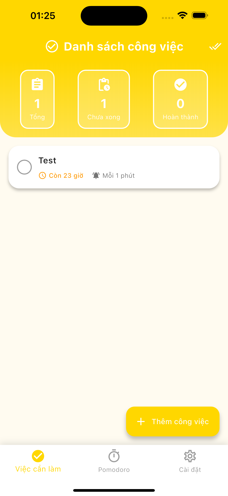
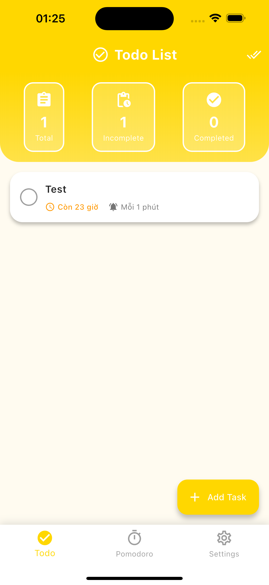
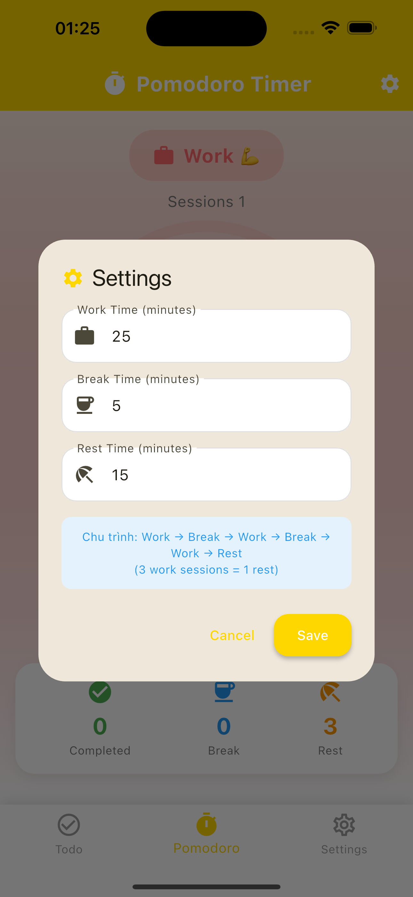
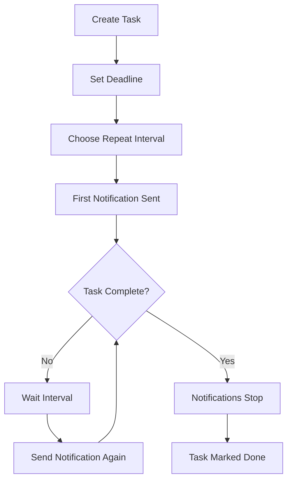

<div align="center">


# 🔥 Doping

**The Productivity App That Won't Let You Procrastinate**

[](https://flutter.dev)
[](https://dart.dev)
[](LICENSE)

### ⚡ Aggressive Task Management + ⏱️ Pomodoro Timer = 💪 Unstoppable Productivity

*Stop procrastinating. Start doing.*

</div>

---

## 💥 What Makes Doping Different?

Most todo apps are **soft**. They send you one gentle reminder and give up when you ignore it.

**Not Doping.**

Doping is the productivity app with **teeth**. It uses **relentless recurring notifications** to keep your tasks front and center until you actually complete them. Combined with an integrated **Pomodoro Timer**, Doping creates a productivity system that's impossible to ignore.

### 🎯 Core Philosophy

1. **📢 Relentless Reminders**: Set recurring notifications from every minute to every week - your tasks will haunt you until completed
2. **⏱️ Focused Work Sessions**: Built-in Pomodoro timer keeps you in the zone with structured work/break cycles
3. **⚡ Zero Escape Routes**: Quick actions let you complete tasks from notifications, but you can't dismiss them without action
4. **📊 Accountability**: Live statistics track your progress - no hiding from incomplete tasks

---

## 📱 Screenshots

<div align="center">

| Persistent Todo List | Quick Task Creation | Integrated Pomodoro |
|:--------------------:|:-------------------:|:-------------------:|
|  |  |  |

| Language Settings | Relentless Notifications |
|:-----------------:|:------------------------:|
|  |  |

</div>

---

## 🔥 Killer Features

### 1. 📢 **Relentless Recurring Notifications** - The Heart of Doping

**The Problem**: Traditional todo apps send one notification that you swipe away and forget.

**The Doping Solution**: 
- ⏰ **Continuous Reminders**: Choose intervals from **1 minute to 1 week** - your task will keep notifying you
- 🔁 **Never Stops Until Done**: Notifications repeat at your chosen interval until you mark the task complete
- 🚫 **No Easy Escape**: Can't just dismiss - you have to take action
- ⚡ **Quick Complete Action**: Tap "✓ Complete" directly from notification to mark done instantly
- 🎯 **Deadline Pressure**: Visual countdown shows time remaining (hours, minutes) or OVERDUE status

**Perfect For:**
- Important recurring tasks that MUST get done
- Breaking procrastination cycles
- Building consistent habits
- Accountability partners who won't give up

**Available Intervals:**
```
Every 1 minute  → For urgent tasks requiring immediate attention
Every 5 minutes → For high-priority items you're actively avoiding
Every 10 minutes → Persistent reminders during work sessions  
Every 30 minutes → Regular check-ins throughout the day
Every 1 hour → Hourly accountability nudges
Every 1 day → Daily recurring responsibilities  
Every 1 week → Weekly review reminders
```

### 2. 🍅 **Integrated Pomodoro Timer** - Structured Productivity

**Why Pomodoro + Recurring Notifications = Productivity Perfection**

The Pomodoro Technique structures your work into focused sessions. Doping's recurring notifications ensure you actually START those sessions.

**Features:**
- ⏱️ **Customizable Sessions**: Set your own Work, Break, and Rest durations
- 🔄 **Automatic Cycling**: 
  ```
  Work (25 min) → Break (5 min) → Work → Break → Work → Rest (15 min)
  ```
  After 3 work sessions, you get a longer rest period
  
- 🎨 **Visual Progress**: 
  - **Work Phase** (Red): Focus time - get stuff done
  - **Break Phase** (Teal): Short break - recharge
  - **Rest Phase** (Green): Long break - recover fully
  
- 📊 **Session Tracking**: See how many pomodoros you've completed
- 🔔 **Phase Notifications**: Alerts when it's time to work or break
- 📱 **Quick Start Widget**: Launch Pomodoro from home screen (1x1 widget)
- 💾 **Settings Persistence**: Your preferences are saved

**The Workflow:**
1. Check your todo list with upcoming notifications
2. Start Pomodoro timer for focused work
3. Work until notification reminds you
4. Complete task and stop the recurring notifications
5. Take your earned break

### 3. ⚡ **Zero-Friction Task Management**

- **1x1 Quick Add Widget**: Add tasks in seconds from home screen
- **Swipe to Delete**: Clean up completed tasks effortlessly
- **One-Tap Complete**: Check tasks done from notifications or list
- **Smart Scheduling**: DatePicker + TimePicker for precise deadlines
- **Rich Task Details**: Title, description, deadline, repeat interval

### 4. 📊 **Live Progress Dashboard**

Your stats update in real-time:
- **Total Tasks**: Everything on your plate
- **Incomplete**: What's still haunting you
- **Completed**: Your victories

### 5. 🌍 **Bilingual Support**

- 🇬🇧 **English** 
- 🇻🇳 **Tiếng Việt**
- ⚙️ Switch languages instantly from Settings

---

## 🎯 Perfect For

✅ **Chronic Procrastinators**: The app won't let you forget  
✅ **ADHD Warriors**: Constant reminders keep tasks visible  
✅ **Accountability Seekers**: Like having a persistent productivity coach  
✅ **Pomodoro Practitioners**: Built-in timer means one less app  
✅ **Habit Builders**: Recurring reminders build consistency  
✅ **Students & Professionals**: Deadline-driven work with focus sessions

---

## 🚀 Quick Start

### Installation

```bash
# Clone repository
git clone https://github.com/yourusername/doping.git
cd doping

# Install dependencies
flutter pub get

# Run on your device
flutter run
```

### First-Time Setup

1. **Grant Notification Permissions**: Doping NEEDS this to keep you accountable
2. **Create Your First Task**:
   - Tap the yellow `+` button
   - Set a deadline
   - Choose notification interval (start with 30 minutes if unsure)
   - Hit Save
3. **Prepare to Be Reminded**: Your task will start notifying you at your chosen interval
4. **Complete It**: Tap ✓ in the notification or tap the checkbox to stop the reminders

### Using Pomodoro

1. Switch to **Pomodoro** tab
2. Tap **Settings** to customize durations
3. Hit **Start** when ready to focus
4. Work until the notification says "Work phase complete!"
5. Take your break
6. Repeat

---

## 📖 How It Works

### The Relentless Reminder System



**Key Points:**
- Notifications start at task creation
- They repeat **forever** at your chosen interval
- They **only stop** when you mark task complete
- Quick action in notification = fastest way to silence them
- Miss your deadline? Notifications turn red and say "OVERDUE"

### The Pomodoro Cycle

```
Session 1: Work (25m) → Break (5m)
Session 2: Work (25m) → Break (5m)  
Session 3: Work (25m) → Rest (15m) ← Longer break after 3 sessions
→ Cycle repeats
```

Each phase completion triggers a notification. Can't ignore when it's time to work or break.

---

## 🛠️ Tech Stack

**Frontend**: Flutter 3.10.4 (Dart 3.0+)  
**State Management**: Provider  
**Database**: SQLite (sqflite)  
**Notifications**: flutter_local_notifications + timezone  
**Widgets**: home_widget (Android)  
**Localization**: flutter_localizations + intl  

**Key Libraries:**
```yaml
dependencies:
  sqflite: ^2.3.0                          # Local database
  flutter_local_notifications: ^17.0.0     # Persistent notifications
  timezone: ^0.9.2                         # Scheduled notifications
  shared_preferences: ^2.2.2               # Settings storage
  home_widget: ^0.6.0                      # Home screen widgets
  provider: ^6.1.0                         # State management
```

---

## 🎨 Design System

### Color Psychology

| Color | Hex | Usage | Psychology |
|-------|-----|-------|------------|
| **Primary Yellow** | `#FFD700` | Actions, CTAs | Energy, urgency, attention-grabbing |
| **Work Red** | `#FF6B6B` | Pomodoro work phase | Intense focus, alertness |
| **Break Teal** | `#4ECDC4` | Short breaks | Calm, refreshing |
| **Rest Green** | `#95E1D3` | Long breaks | Recovery, peace |
| **Overdue Red** | `#FF0000` | Missed deadlines | Warning, critical |

---

## 📱 Widgets & Notifications

### Android Widgets (1x1)

**Todo Widget**: Yellow `+` button → Opens add task screen  
**Pomodoro Widget**: Red `▶` button → Starts timer immediately

Add widgets:
1. Long-press home screen
2. Tap "Widgets"
3. Find "Doping"
4. Drag to home screen

### Notification Actions

Every task notification includes:
- **✓ Complete**: Mark done instantly without opening app
- **Tap notification**: Open task details to edit

**Permissions Required (Android):**
- `POST_NOTIFICATIONS` - Send reminders
- `SCHEDULE_EXACT_ALARM` - Precise timing
- `USE_EXACT_ALARM` - Background scheduling
- `RECEIVE_BOOT_COMPLETED` - Survive device restart

---

## 🔧 Configuration

### Customize Notification Frequency

Edit intervals in `AddEditTodoScreen`:
```dart
final List<Map<String, dynamic>> _getRepeatIntervals(BuildContext context) {
  return [
    {'label': '1 minute', 'minutes': 1},    // Most aggressive
    {'label': '5 minutes', 'minutes': 5},
    {'label': '10 minutes', 'minutes': 10},
    // ... add your own intervals
  ];
}
```

### Customize Pomodoro Defaults

In `PomodoroService`:
```dart
_settings = PomodoroSettings(
  workMinutes: 25,    // Change default work time
  breakMinutes: 5,    // Change default break time
  restMinutes: 15,    // Change default rest time
);
```

---

## 📂 Project Structure

```
doping/
├── lib/
│   ├── l10n/                      # Translations (EN, VI)
│   ├── models/
│   │   ├── todo_model.dart        # Task data structure
│   │   └── pomodoro_*.dart        # Timer models
│   ├── services/
│   │   ├── database_helper.dart   # SQLite operations
│   │   ├── notification_service.dart  # Relentless reminders 🔥
│   │   └── pomodoro_service.dart  # Timer logic
│   ├── screens/
│   │   ├── todo_list_screen.dart  # Task dashboard
│   │   ├── add_edit_todo_screen.dart
│   │   ├── pomodoro_screen.dart   # Timer interface
│   │   └── settings_screen.dart
│   └── main.dart
├── android/
│   └── app/src/main/kotlin/
│       ├── TodoWidgetProvider.kt      # Quick add widget
│       └── PomodoroWidgetProvider.kt  # Quick start widget
└── assets/icon/
    └── app_icon.svg               # Clock + Check + Tomato logo
```

---

## 🎯 Use Cases

### 1. Breaking Procrastination
**Problem**: You keep putting off that important task.

**Doping Solution**:
- Create task with 10-minute repeat interval
- Set deadline for today
- Get reminded every 10 minutes until done
- Can't ignore it - notifications won't stop

### 2. Building Habits
**Problem**: Want to drink water every hour, but forget.

**Doping Solution**:
- Create "Drink Water" task
- Set 1-hour repeat interval
- No deadline (ongoing)
- Persistent hourly reminders

### 3. Exam Study Sessions
**Problem**: Need focused study time with breaks.

**Doping Solution**:
- Create study tasks with 30-min reminders
- Use Pomodoro: 25min study → 5min break
- Notifications keep you honest
- Stats track completed sessions

### 4. Project Deadlines
**Problem**: Big project, easy to forget milestones.

**Doping Solution**:
- Break into tasks with deadlines
- Set aggressive reminders (5-15 min)
- As deadline approaches, notifications get more urgent
- Dashboard shows incomplete count (guilt factor)

---

## 🚧 Known Limitations

- ⚠️ Widget updates require app to be running (Android platform limit)
- ⚠️ macOS notifications need additional entitlements
- ⚠️ Can't snooze notifications (by design - complete the task!)

---

## 🗺️ Roadmap

### v1.1 - Cloud Sync
- [ ] Firebase backend
- [ ] Cross-device synchronization
- [ ] Notification sync across devices
- [ ] Dark mode

### v1.2 - Enhanced Accountability  
- [ ] Task priority levels (with even MORE aggressive reminders for high priority)
- [ ] Weekly progress reports
- [ ] Streak tracking
- [ ] Social accountability (share progress)

### v1.3 - Advanced Features
- [ ] Custom notification sounds (air horn mode?)
- [ ] Location-based reminders
- [ ] Integration with calendar
- [ ] Team/shared tasks

---

## 🤝 Contributing

Doping is open source! See [CONTRIBUTING.md](CONTRIBUTING.md) for guidelines.

**Areas we'd love help with:**
- More aggressive notification strategies
- Additional Pomodoro presets
- UI/UX improvements for productivity
- More languages
- iOS widgets support

---

## ⚖️ License

MIT License - See [LICENSE](LICENSE) for details.

Free to use, modify, and distribute. Use it to build better productivity habits!

---

## 🙏 Acknowledgments

Built with:
- [Flutter](https://flutter.dev) - Beautiful cross-platform UI
- [sqflite](https://pub.dev/packages/sqflite) - Reliable local storage
- [flutter_local_notifications](https://pub.dev/packages/flutter_local_notifications) - The relentless notification engine

Inspired by people who need that extra push to get things done. 💪

---

<div align="center">

### 🔥 Stop Procrastinating. Start Doping. 🔥

**Download • Remind • Complete • Repeat**

---

Made with 💪 and ☕ for productivity warriors everywhere

*"The app that won't let you give up on yourself."*

</div>

